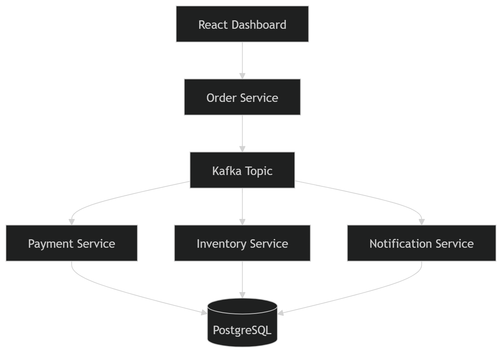

# 🚀 Kafka Microservices Platform

> Event-Driven Microservices Architecture built using Spring Boot, Apache Kafka, PostgreSQL, Docker, React, Vite and TypeScript.

---

## 📖 Overview

Kafka Microservices Platform is a full-stack event-driven system designed to demonstrate how modern microservices communicate asynchronously through Apache Kafka.

A user creates an order through a React Dashboard. The Order Service persists the order and publishes an event to Kafka. Multiple consumer services independently process the same event to handle payments, inventory updates, and notifications.

This project showcases real-world concepts such as:

- Event-Driven Architecture
- Apache Kafka Messaging
- Asynchronous Communication
- Spring Boot Microservices
- PostgreSQL Persistence
- Docker Containerization
- React Monitoring Dashboard

---

# 🏗️ Architecture Diagram



---

# ⚡ System Workflow

```text
User
 │
 ▼
React Dashboard
 │
 ▼
Order Service
 │
 ▼
Apache Kafka (orders topic)
 │
 ├────────► Payment Service
 │
 ├────────► Inventory Service
 │
 └────────► Notification Service
 │
 ▼
PostgreSQL Database
```

---

# 🧩 Architecture Components

## Frontend Layer

### React Dashboard

Built using:

- React
- Vite
- TypeScript
- Tailwind CSS
- Framer Motion

Features:

- Create Orders
- Live Dashboard Metrics
- Service Monitoring
- Event Stream Visualization
- Order Lifecycle Tracking

---

## Order Management Service

**Port:** `8080`

Responsibilities:

- Accept order requests
- Store orders in PostgreSQL
- Publish OrderEvent to Kafka

Technologies:

- Spring Boot
- Spring Data JPA
- PostgreSQL
- Apache Kafka Producer

---

## Apache Kafka

Topic:

```text
orders
```

Responsibilities:

- Event Streaming
- Asynchronous Communication
- Decoupled Service Interaction

The Order Service acts as the producer while all downstream services act as consumers.

---

## Consumer Microservices

### Payment Service

**Port:** `8081`

Responsibilities:

- Consume OrderEvent
- Process Payment
- Store Payment Records

---

### Inventory Service

**Port:** `8082`

Responsibilities:

- Consume OrderEvent
- Update Inventory
- Store Inventory Records

---

### Notification Service

**Port:** `8083`

Responsibilities:

- Consume OrderEvent
- Generate Notifications
- Store Notification Records

---

# 🗄️ Database Design

Database:

```text
orderdb
```

Tables:

```text
orders
payments
inventory
notifications
```

Each microservice persists its own processing result into PostgreSQL.

---

# 🛠️ Technology Stack

## Backend

- Java 21
- Spring Boot
- Spring Data JPA
- Apache Kafka
- Maven

## Frontend

- React
- Vite
- TypeScript
- Tailwind CSS
- Framer Motion

## Database

- PostgreSQL

## Infrastructure

- Docker
- Docker Compose

---

# 📂 Project Structure

```text
Kafka-Microservices-Platform
│
├── frontend
│
├── order_service
│
├── payment_service
│
├── inventory_service
│
├── notification_service
│
├── docs
│   └── architecture-diagram.png
│
├── docker-compose.yml
│
├── .gitignore
│
└── README.md
```

---

# 🔄 Event Flow

### 1. Order Creation

User creates an order from the React Dashboard.

### 2. Order Persistence

Order Service stores the order in PostgreSQL.

### 3. Event Publication

Order Service publishes an `OrderEvent` to Kafka.

### 4. Event Consumption

The following services consume the same event:

- Payment Service
- Inventory Service
- Notification Service

### 5. Database Updates

Each service stores its processing result independently.

---

# 🚀 Getting Started

## Clone Repository

```bash
git clone https://github.com/MrudulShah24/Kafka-Microservices-Platform.git
cd Kafka-Microservices-Platform
```

---

## Start Infrastructure

```bash
docker-compose up -d
```

This starts:

- Apache Kafka
- PostgreSQL

---

## Start Backend Services

### Order Service

```bash
cd order_service
mvn spring-boot:run
```

### Payment Service

```bash
cd payment_service
mvn spring-boot:run
```

### Inventory Service

```bash
cd inventory_service
mvn spring-boot:run
```

### Notification Service

```bash
cd notification_service
mvn spring-boot:run
```

---

## Start Frontend

```bash
cd frontend
npm install
npm run dev
```

Frontend:

```text
http://localhost:5173
```

---

# ✨ Dashboard Features

- Live Order Metrics
- Payment Tracking
- Inventory Monitoring
- Notification Monitoring
- Service Health Dashboard
- Event Stream Visualization
- Order Lifecycle Tracking
- Modern Responsive UI
- Real-Time Data Refresh

---

# 🎯 Learning Outcomes

This project demonstrates practical experience with:

- Event-Driven Systems
- Kafka Producers & Consumers
- Microservices Architecture
- Spring Boot Development
- Dockerized Applications
- Database Integration
- Frontend + Backend Integration
- Distributed System Design

---

# 🔮 Future Enhancements

- API Gateway
- JWT Authentication
- Role Based Access Control
- Redis Caching
- Distributed Tracing
- Kafka Monitoring Dashboard
- Prometheus & Grafana
- Kubernetes Deployment
- CI/CD Pipeline
- Cloud Deployment (AWS/Azure)

---

# 👨‍💻 Author

**Mrudul Shah**

GitHub:

https://github.com/MrudulShah24

