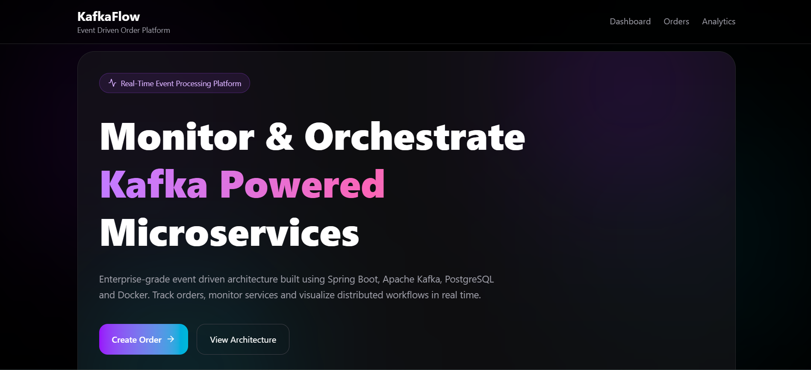
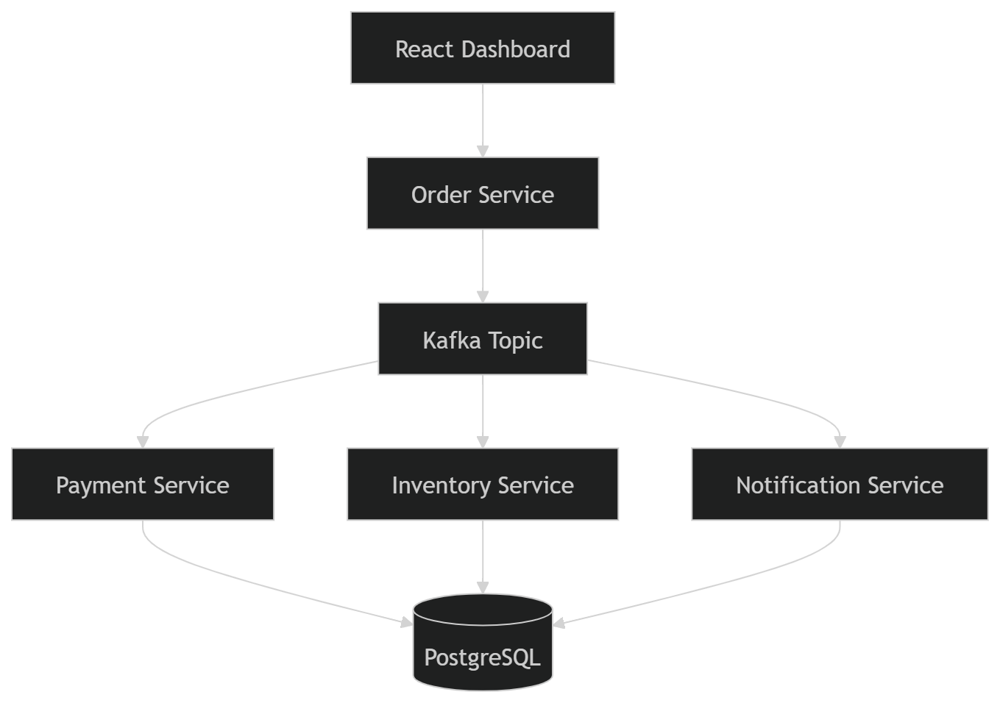

# 🚀 Kafka Microservices Platform


> Event-Driven Microservices Architecture built using Spring Boot, Apache Kafka, PostgreSQL, Docker, React, Vite and TypeScript.

---

## 🌟 Project Highlights

* ✅ Event-Driven Architecture
* ✅ Apache Kafka Producer & Consumers
* ✅ Spring Boot Microservices
* ✅ PostgreSQL Persistence
* ✅ Dockerized Infrastructure
* ✅ React Monitoring Dashboard
* ✅ Service Health Monitoring
* ✅ Live Metrics Dashboard
* ✅ Order Lifecycle Tracking
* ✅ Real-Time Data Refresh

---

# 📸 Dashboard Preview

## Main Dashboard



---

# 🏗️ Architecture Diagram



---

# 📖 Overview

Kafka Microservices Platform demonstrates how modern distributed systems communicate asynchronously through Apache Kafka.

A user creates an order from the React Dashboard. The Order Service stores the order in PostgreSQL and publishes an event to Kafka. Multiple downstream microservices consume the same event independently and perform their own business operations.

This project simulates a real-world event-driven workflow commonly used in modern enterprise applications.

---

# ⚡ System Workflow

```text
User
 │
 ▼
React Dashboard
 │
 ▼
Order Service
 │
 ▼
Apache Kafka (orders topic)
 │
 ├────────► Payment Service
 │
 ├────────► Inventory Service
 │
 └────────► Notification Service
 │
 ▼
PostgreSQL Database
```

---

# 🧩 Architecture Components

## Frontend Layer

### React Dashboard

Built using:

* React
* Vite
* TypeScript
* Tailwind CSS
* Framer Motion

Features:

* Create Orders
* Live Metrics Dashboard
* Service Health Monitoring
* Event Stream Visualization
* Order Lifecycle Tracking

---

## Order Service (8080)

Responsibilities:

* Accept order requests
* Persist orders
* Publish OrderEvent to Kafka

Technology:

* Spring Boot
* Spring Data JPA
* PostgreSQL
* Apache Kafka Producer

---

## Apache Kafka

Topic:

orders

Responsibilities:

* Event Streaming
* Asynchronous Communication
* Decoupled Microservices
* Reliable Event Distribution

---

## Consumer Microservices

### Payment Service (8081)

* Consume OrderEvent
* Process Payment
* Persist Payment Records

### Inventory Service (8082)

* Consume OrderEvent
* Update Inventory
* Persist Inventory Records

### Notification Service (8083)

* Consume OrderEvent
* Generate Notifications
* Persist Notification Records

---

# 🗄️ Database Design

Database:

orderdb

Tables:

* orders
* payments
* inventory
* notifications

Each microservice persists its own processing result independently.

---

# 🛠️ Technology Stack

## Backend

* Java 21
* Spring Boot
* Spring Data JPA
* Apache Kafka
* Maven

## Frontend

* React
* Vite
* TypeScript
* Tailwind CSS
* Framer Motion

## Database

* PostgreSQL

## Infrastructure

* Docker
* Docker Compose

---

# 📂 Project Structure

```text
Kafka-Microservices-Platform
│
├── frontend
├── order_service
├── payment_service
├── inventory_service
├── notification_service
│
├── docs
│   ├── architecture-diagram.png
│   └── dashboard.png
│
├── docker-compose.yml
├── .gitignore
└── README.md
```

---

# 🔄 Event Flow

### Step 1 — Order Creation

User creates an order from the React Dashboard.

### Step 2 — Order Persistence

Order Service stores the order in PostgreSQL.

### Step 3 — Event Publication

Order Service publishes an OrderEvent to Kafka.

### Step 4 — Event Consumption

The following services consume the event:

* Payment Service
* Inventory Service
* Notification Service

### Step 5 — Database Updates

Each service stores its own processing result into PostgreSQL.

---

# 🚀 Getting Started

## Clone Repository

```bash
git clone https://github.com/MrudulShah24/Kafka-Microservices-Platform.git
cd Kafka-Microservices-Platform
```

## Start Infrastructure

```bash
docker-compose up -d
```

This starts:

* Apache Kafka
* PostgreSQL

## Start Backend Services

### Order Service

```bash
cd order_service
mvn spring-boot:run
```

### Payment Service

```bash
cd payment_service
mvn spring-boot:run
```

### Inventory Service

```bash
cd inventory_service
mvn spring-boot:run
```

### Notification Service

```bash
cd notification_service
mvn spring-boot:run
```

## Start Frontend

```bash
cd frontend
npm install
npm run dev
```

Frontend URL:

```text
http://localhost:5173
```

---

# ✨ Dashboard Features

* Live Order Metrics
* Payment Monitoring
* Inventory Monitoring
* Notification Monitoring
* Service Health Dashboard
* Event Stream Visualization
* Order Lifecycle Tracking
* Modern Responsive UI
* Auto Refreshing Metrics

---

# 🎯 Learning Outcomes

This project demonstrates practical experience with:

* Event-Driven Systems
* Apache Kafka
* Spring Boot Microservices
* Dockerized Applications
* PostgreSQL Integration
* Frontend + Backend Communication
* Distributed System Design
* Real-Time Monitoring Dashboards

---

# 🔮 Future Enhancements

* API Gateway
* JWT Authentication
* Role-Based Access Control
* Redis Caching
* Distributed Tracing
* Kafka Monitoring Dashboard
* Prometheus & Grafana
* Kubernetes Deployment
* CI/CD Pipelines
* AWS / Azure Deployment

---

# 👨‍💻 Author

Mrudul Shah

GitHub:
https://github.com/MrudulShah24

---

# ⭐ Support

If you found this project useful, consider giving the repository a star.
