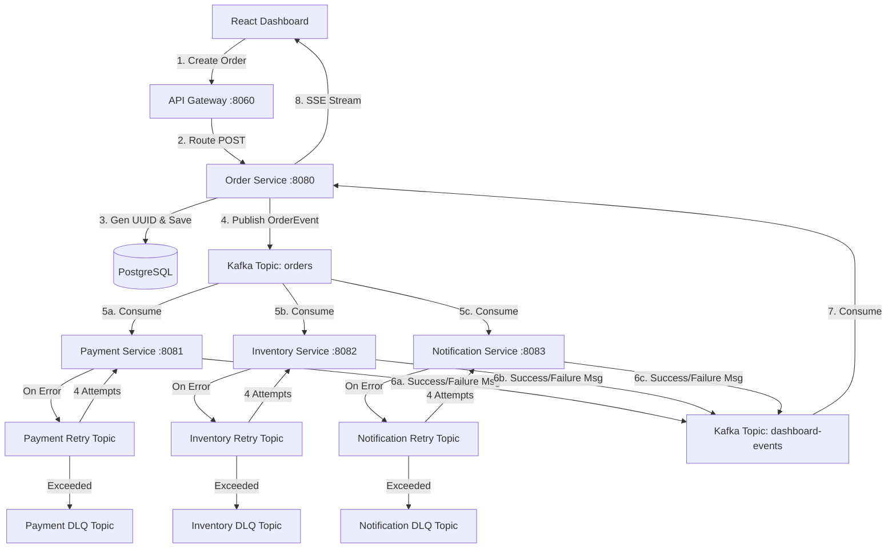

# 🚀 Kafka Microservices Platform


[](https://github.com/MrudulShah24/Kafka-Microservices-Platform/actions/workflows/ci.yml)

> Event-Driven Microservices Architecture built using Spring Boot, Apache Kafka, PostgreSQL, Docker, React, Vite and TypeScript.

---

## 🌟 Project Highlights

* ✅ Event-Driven Architecture
* ✅ Apache Kafka Producer & Consumers
* ✅ Spring Boot Microservices
* ✅ PostgreSQL Persistence
* ✅ Dockerized Infrastructure
* ✅ React Monitoring Dashboard
* ✅ Service Health Monitoring
* ✅ Live Metrics Dashboard
* ✅ Order Lifecycle Tracking
* ✅ Correlation ID / Tracking ID Propagation
* ✅ Real-Time Data Refresh

---

# 📸 Dashboard Preview

## Main Dashboard


---

# 🏗️ Architecture Diagram


---

# 📖 Overview

Kafka Microservices Platform demonstrates how modern distributed systems communicate asynchronously through Apache Kafka.

A user creates an order from the React Dashboard. The Order Service stores the order in PostgreSQL and publishes an event to Kafka. Multiple downstream microservices consume the same event independently and perform their own business operations.

This project simulates a real-world event-driven workflow commonly used in modern enterprise applications.

---

# ⚡ System Workflow

```text
User
 │
 ▼
React Dashboard
 │
 ▼
Order Service
 │
 ▼
Apache Kafka (orders topic)
 │
 ├────────► Payment Service
 │
 ├────────► Inventory Service
 │
 └────────► Notification Service
 │
 ▼
PostgreSQL Database
```

---

## 📊 Event-Driven Architecture Flowchart


```mermaid
flowchart TD
    Dashboard[React Dashboard] -->|1. Create Order| Gateway[API Gateway :8060]
    Gateway -->|2. Route POST| OrderService[Order Service :8080]
    OrderService -->|3. Gen UUID & Save| DB[(PostgreSQL)]
    OrderService -->|4. Publish OrderEvent| KafkaOrders[Kafka Topic: orders]
    
    KafkaOrders -->|5a. Consume| Payment[Payment Service :8081]
    KafkaOrders -->|5b. Consume| Inventory[Inventory Service :8082]
    KafkaOrders -->|5c. Consume| Notification[Notification Service :8083]
    
    Payment -->|On Error| PayRetry[Payment Retry Topic]
    PayRetry -->|4 Attempts| Payment
    PayRetry -->|Exceeded| PayDLQ[Payment DLQ Topic]
    
    Inventory -->|On Error| InvRetry[Inventory Retry Topic]
    InvRetry -->|4 Attempts| Inventory
    InvRetry -->|Exceeded| InvDLQ[Inventory DLQ Topic]
    
    Notification -->|On Error| NotRetry[Notification Retry Topic]
    NotRetry -->|4 Attempts| Notification
    NotRetry -->|Exceeded| NotDLQ[Notification DLQ Topic]
    
    Payment -->|6a. Success/Failure Msg| KafkaDash[Kafka Topic: dashboard-events]
    Inventory -->|6b. Success/Failure Msg| KafkaDash
    Notification -->|6c. Success/Failure Msg| KafkaDash
    
    KafkaDash -->|7. Consume| OrderService
    OrderService -->|8. SSE Stream| Dashboard
```

---

## 🛠️ Fault Tolerance & Correlation ID Propagation

### 🆔 Tracking ID Propagation (Correlation ID)
Every order receives a unique, database-indexed `trackingId` generated inside **Order Service** using `UUID.randomUUID().toString()`. This Tracking ID propagates as a correlation ID across the entire system:
- **Propagation Loop**: `Order Service` ➜ `Kafka (orders topic)` ➜ `Downstream Services` ➜ `Kafka (dashboard-events topic)` ➜ `Order Service SSE` ➜ `React Dashboard`.
- This ensures all downstream events (successes and DLT failures) reuse the same original Tracking ID, enabling the React frontend to group timeline events and query the order lifecycle state dynamically.

### 🔄 Resilience (Retry Topics & Dead Letter Queues)
- **Retry Mechanism**: Kafka consumers use Spring `@RetryableTopic` for robust processing. On transient failures, messages are retried up to 4 times with exponential backoff delays.
- **Dead Letter Queue (DLQ)**: If retries are exhausted (or a simulated permanent error is hit), the message is routed to the Dead Letter Topic (DLQ), and a failure event message carrying the tracking ID is emitted to update the live stream.

---

# 🧩 Architecture Components

## Frontend Layer

### React Dashboard

Built using:

* React
* Vite
* TypeScript
* Tailwind CSS
* Framer Motion

Features:

* Create Orders
* Live Metrics Dashboard
* Service Health Monitoring
* Event Stream Visualization
* Order Lifecycle Tracking

---

## API Gateway (8060)

Responsibilities:
* Gateway entry point for all React frontend traffic
* Strips `/api` prefixes and routes internally using container names
* Deduplicates response headers (CORS and credentials)
* Allows global CORS credential requests from the dashboard

---

## Order Service (8080)

Responsibilities:

* Accept order requests
* Persist orders
* Publish OrderEvent to Kafka
* Expose order status check endpoint `GET /orders/{trackingId}/status` across all microservices data stores

Technology:

* Spring Boot
* Spring Data JPA
* PostgreSQL
* Apache Kafka Producer

---

## Apache Kafka

Topic:

orders

Responsibilities:

* Event Streaming
* Asynchronous Communication
* Decoupled Microservices
* Reliable Event Distribution

---

## Consumer Microservices

### Payment Service (8081)

* Consume OrderEvent
* Process Payment
* Persist Payment Records

### Inventory Service (8082)

* Consume OrderEvent
* Update Inventory
* Persist Inventory Records

### Notification Service (8083)

* Consume OrderEvent
* Generate Notifications
* Persist Notification Records

---

# 🗄️ Database Design

Database:

orderdb

Tables:

* orders
* payments
* inventory
* notifications

Each microservice persists its own processing result independently.

---

# 🛠️ Technology Stack

## Backend

* Java 21
* Spring Boot
* Spring Data JPA
* Apache Kafka
* Maven

## Frontend

* React
* Vite
* TypeScript
* Tailwind CSS
* Framer Motion

## Database

* PostgreSQL

## Infrastructure

* Docker
* Docker Compose

---

# 📂 Project Structure

```text
Kafka-Microservices-Platform
│
├── api_gateway
├── frontend
├── order_service
├── payment_service
├── inventory_service
├── notification_service
│
├── docs
│   ├── architecture-diagram.png
│   └── dashboard.png
│
├── docker-compose.yml
├── .gitignore
└── README.md
```

---

# 🔄 Event Flow

### Step 1 — Order Creation

User creates an order from the React Dashboard.

### Step 2 — Order Persistence

Order Service stores the order in PostgreSQL.

### Step 3 — Event Publication

Order Service publishes an OrderEvent to Kafka.

### Step 4 — Event Consumption

The following services consume the event:

* Payment Service
* Inventory Service
* Notification Service

### Step 5 — Database Updates

Each service stores its own processing result into PostgreSQL.

---

# 🚀 Getting Started

You can run the entire platform using two approaches: **Docker Compose (Recommended)** or **Local Developer Mode**.

---

## Prerequisites
* **Docker Desktop** installed and running on your machine
* **Java 21** & **Maven** (only if running backend services locally outside of Docker)
* **Node.js & npm** (for running the React frontend dashboard)

---

## Method A: Run Entire Stack in Docker (Recommended)

This is the simplest way to run the project. A single Docker Compose command builds and launches the database, Kafka broker, the API Gateway, and all 4 microservices.

### Step 1: Package Microservice JARs
Before building the Docker images, we package the Java source files into runnable `.jar` files. Run this command in the project root:
```bash
mvn clean package -DskipTests
```
* `mvn clean`: Deletes any previously compiled files/folders in the `target/` directories, ensuring you start with a clean state.
* `mvn package`: Compiles the Java code and creates a runnable JAR package inside the `target/` folder of each microservice directory.
* `-DskipTests`: Skips compiling and running unit tests (since databases and Kafka are not yet running, tests that check connectivity would fail).

### Step 2: Build & Start Containers
Run this command in the root folder (where `docker-compose.yml` is located):
```bash
docker-compose up --build -d
```
* `up`: Recreates, starts, and attaches containers for all services defined in `docker-compose.yml`.
* `--build`: Forces Docker to rebuild the container images from the Dockerfile of each service directory (incorporating the latest packaged JAR files).
* `-d`: Runs containers in "detached" mode (in the background, freeing up your terminal window).

---

## Method B: Local Development Mode (Hybrid)

If you are developing and modifying Java code, you can run only the database and Kafka in Docker, while running the microservice applications locally on your machine.

### Step 1: Start PostgreSQL & Kafka in Docker
```bash
docker-compose up -d postgres kafka
```

### Step 2: Run Microservices Locally
Open a separate terminal window for each service and run the `mvn spring-boot:run` boot command in their respective directories:

* **API Gateway (8060)**:
  ```bash
  cd api_gateway
  mvn spring-boot:run
  ```
* **Order Service (8080)**:
  ```bash
  cd order_service
  mvn spring-boot:run
  ```
* **Payment Service (8081)**:
  ```bash
  cd payment_service
  mvn spring-boot:run
  ```
* **Inventory Service (8082)**:
  ```bash
  cd inventory_service
  mvn spring-boot:run
  ```
* **Notification Service (8083)**:
  ```bash
  cd notification_service
  mvn spring-boot:run
  ```

---

## Start Frontend Dashboard

Regardless of which method you chose to run the backend, run the React frontend dashboard locally:

```bash
cd frontend
npm install   # Installs React, TypeScript, and UI dependencies
npm run dev   # Boots up the local Vite developer web server
```

Open your browser to:
👉 **http://localhost:5173**

---

## Service Health & Actuator

The API Gateway exposes its health status actuator check at:
👉 **http://localhost:8060/actuator/health**

The React dashboard monitors downstream services by performing lightweight HTTP checks on their primary lists through the Gateway:
* Order Service Check ➜ `http://localhost:8060/api/orders`
* Payment Service Check ➜ `http://localhost:8060/api/payments`
* Inventory Service Check ➜ `http://localhost:8060/api/inventory`
* Notification Service Check ➜ `http://localhost:8060/api/notifications`
* Order Status Tracking ➜ `http://localhost:8060/api/orders/{trackingId}/status`

If you run services with Docker, remember to re-run `mvn clean package -DskipTests` and rebuild the images with `docker-compose up --build -d` after making any Java code modifications.

## Operations Guide

See `docs/OPERATIONS.md` for ports, health checks, and common issues.

---

# ✨ Dashboard Features

* Live Order Metrics
* Payment Monitoring
* Inventory Monitoring
* Notification Monitoring
* Service Health Dashboard
* Event Stream Visualization
* Order Lifecycle Tracking
* Modern Responsive UI
* Auto Refreshing Metrics

---

# 🎯 Learning Outcomes

This project demonstrates practical experience with:

* Event-Driven Systems
* Apache Kafka
* Spring Boot Microservices
* Dockerized Applications
* PostgreSQL Integration
* Frontend + Backend Communication
* Distributed System Design
* Real-Time Monitoring Dashboards

---

# 🛠️ Continuous Integration

This project uses **GitHub Actions** for Continuous Integration (CI). The workflow is defined in [.github/workflows/ci.yml](file:///.github/workflows/ci.yml) and automatically runs on every push or pull request to the `main` branch.

### Key Features:
* **Parallel Backend Builds**: Utilizes a build matrix to compile and package all four Spring Boot microservices (`order_service`, `payment_service`, `inventory_service`, `notification_service`) in parallel.
* **Frontend Verification**: Installs dependencies and builds the React/Vite/TypeScript frontend, failing if there are any TypeScript compiler or build errors.
* **Dependency Caching**: Employs GitHub Actions caching for both Maven and NPM dependencies to speed up build times.
* **Concurrency Control**: Automatically cancels obsolete or redundant runs for the same branch/PR when new commits are pushed.

---

# 🔮 Future Enhancements

* API Gateway
* JWT Authentication
* Role-Based Access Control
* Redis Caching
* Distributed Tracing
* Kafka Monitoring Dashboard
* Prometheus & Grafana
* Kubernetes Deployment
* CD / Cloud Deployment (AWS / Azure)

---

# 👨‍💻 Author

Mrudul Shah

GitHub:
https://github.com/MrudulShah24

---

# ⭐ Support

If you found this project useful, consider giving the repository a star.

